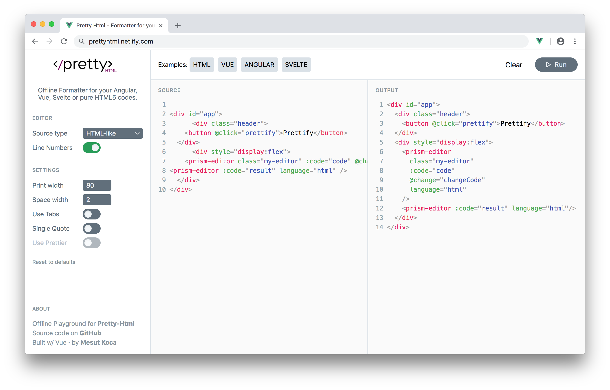

# Pretty HTML

Offline Formatter for your Angular, Vue, Svelte or pure HTML5 codes.

Live: [prettyhtml.netlify.com](https://prettyhtml.netlify.com)



## About

Uses browserified version of the [prettyhtml](https://ghub.io/@starptech/prettyhtml)
(👍)

## Project setup

```
yarn install
```

### Compiles and hot-reloads for development

```
yarn run serve
```

### Compiles and minifies for production

```
yarn run build
```

### Lints and fixes files

```
yarn run lint
```

### Run the unit tests

```
yarn run test:unit
```

## Dependencies

- [vue-prism-editor](https://ghub.io/vue-prism-editor): A dead simple code editor with syntax highlighting and line numbers.
- [tailwindcss](https://ghub.io/tailwindcss): A utility-first CSS framework for rapidly building custom user interfaces.
- [vue](https://ghub.io/vue): Reactive, component-oriented view layer for modern web interfaces.

## Licence

[MIT](https://opensource.org/licenses/MIT) © [Mesut Koca](https://mesutkoca.com)
